# PeopleCore — Workforce Academy & Enterprise HRIS Sandbox

<p align="center">
  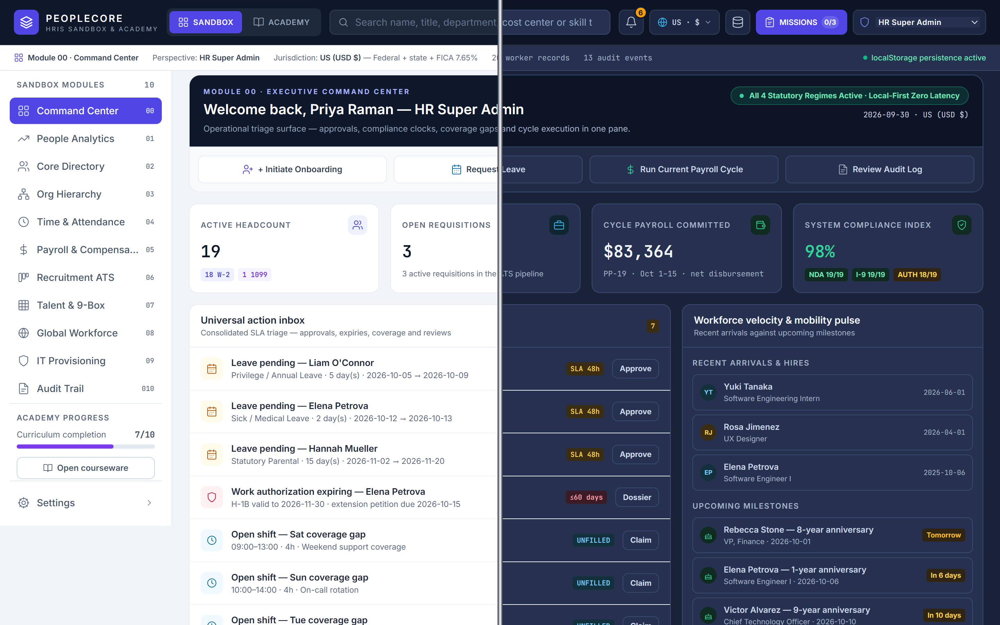
</p>

<p align="center">
  <strong>A zero-latency, 100% client-side enterprise HRIS simulation engine and certified workforce academy.</strong><br>
  <em>Master complex HR operations, multi-jurisdiction statutory payroll, talent acquisition pipelines, organizational design, and regulatory compliance entirely within your browser.</em>
</p>

<p align="center">
  <a href="#-key-architecture"></a>
  <a href="#-quickstart--local-run"></a>
  <a href="#-key-architecture"></a>
  <a href="#-key-architecture"></a>
  <a href="#-key-architecture"></a>
  <a href="https://github.com/NitishKashyapR/peoplecore-hris-sandbox/blob/main/LICENSE"></a>
</p>

<p align="center">
  <a href="#-executive-overview">Executive Overview</a> •
  <a href="#-the-10-workforce-academy-modules">Curriculum</a> •
  <a href="#-enterprise-hris-sandbox-capabilities">Sandbox Features</a> •
  <a href="#-executive-certification--credential-engine">Certification</a> •
  <a href="#-key-architecture">Architecture</a> •
  <a href="#-live-preview--hosting-guide">Hosting Guide</a> •
  <a href="#-quickstart--local-run">Quickstart</a>
</p>

---

## 🏛️ Executive Overview

Modern Human Resource Information Systems (HRIS) sit at the critical intersection of corporate governance, labor jurisprudence, compensation mathematics, and IT identity infrastructure. Yet, practitioners, people-ops engineers, and HR tech analysts are frequently forced to learn mission-critical mechanics on live production databases with high compliance risk.

**PeopleCore Workforce Academy & HRIS Sandbox** is a professional-grade simulation platform built to eliminate that operational barrier. Engineered as a high-fidelity, zero-server web application, PeopleCore replicates the end-to-end operational surface of tier-1 enterprise workforce suites:

1. **Enterprise HRIS Sandbox Mode**: An authentic enterprise operational suite spanning 12 functional areas—from multi-jurisdiction gross-to-net payroll calculators to ATS recruiting funnels, org chart hierarchy visualizers, bulk CSV ingestion pipelines, and cryptographic audit logging.
2. **Workforce Academy Mode**: An intensive, university-grade executive curriculum featuring 10 interactive chapters, dynamic statutory formula laboratories (e.g., Bradford Factor, Adverse Impact 4/5ths, EOR tax exposure), 10 studio-recorded narrative audio lectures (~420 MB total), and an automated 100-question examination suite awarding the verifiable **Certificate of Practical Mastery**.

<p align="center">
  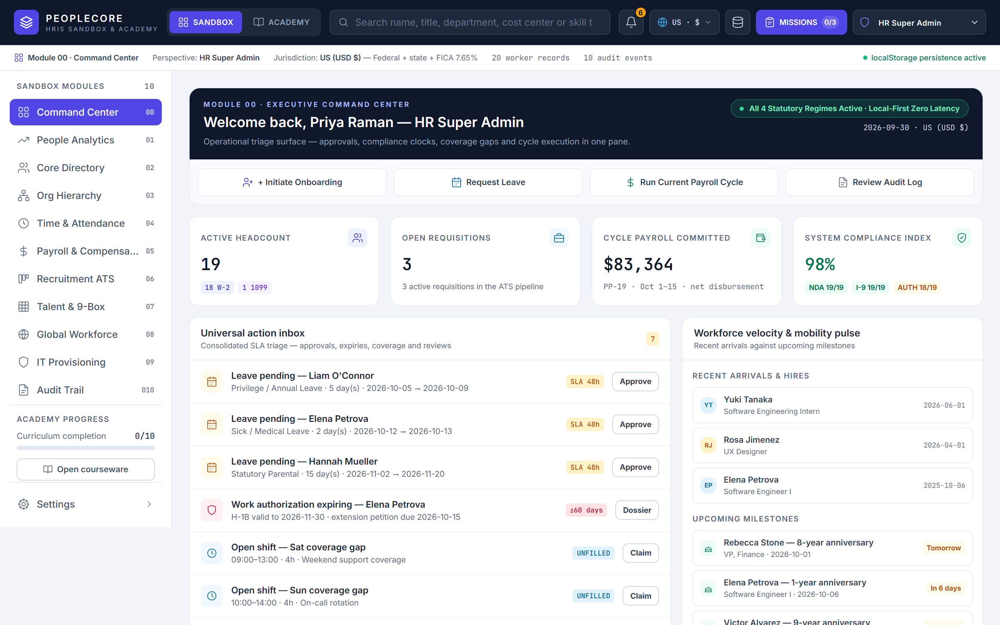
  <em>Executive Command Center: Real-time workforce telemetry, payroll cycle progress, headcount velocity, and predictive attrition radar.</em>
</p>

---

## 🎓 The 10 Workforce Academy Modules

PeopleCore Workforce Academy covers the essential pillars of modern people operations. Each module integrates narrative technical lectures, statutory regulatory inspectors (US, UK, Germany/EU, and India), interactive formula calculation workbenches, and mastery evaluations.

<p align="center">
  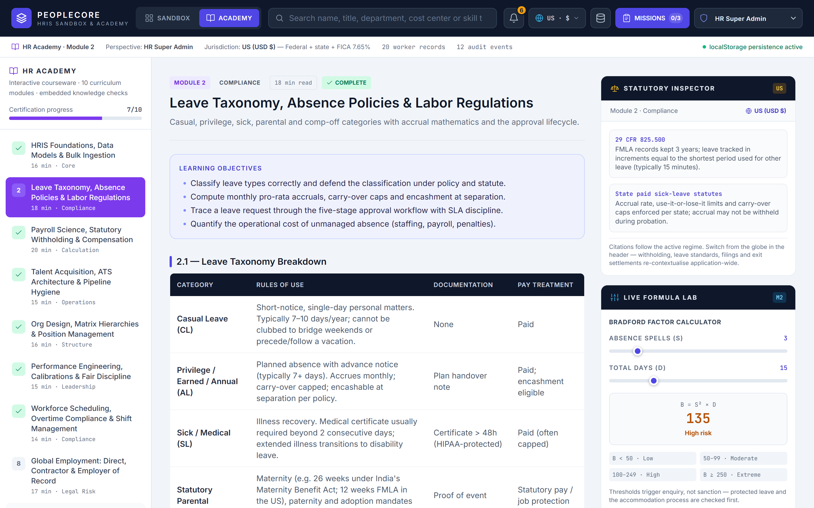
</p>

| # | Curriculum Module | Strategic Domain | Est. Time | Interactive Formula Lab & Statutory Focus | Audio Narration |
|---|---|---|---|---|---|
| **01** | **HRIS Foundations, Data Models & Bulk Ingestion** | Systems Architecture | 16 min | Master-data schemas, immutable employee IDs, reusable seat design, and robust CSV validation pipelines. | `module-01-...m4a` |
| **02** | **Leave Taxonomy, Absence Policies & Labor Law** | Compliance & Ops | 18 min | **Bradford Factor Lab ($B = S^2 \times D$)**: Frequency weighting, disruption curves, and FMLA/statutory leave accrual. | `module-02-...m4a` |
| **03** | **Payroll Science, Statutory Withholding & Comp** | Financial Engineering | 20 min | **Multi-Regime Tax Lab**: 4-stage gross-to-net calculation across US (FICA), UK (PAYE), DE (Lohnsteuer), and IN (TDS). | `module-03-...m4a` |
| **04** | **Talent Acquisition, ATS & Pipeline Hygiene** | Talent Operations | 15 min | **Adverse Impact Lab**: EEOC 4/5ths selection rate formula, structured rubric scorecards, and hiring gate validation. | `module-04-...m4a` |
| **05** | **Org Design, Matrix Hierarchies & Position Mgmt** | Org Development | 16 min | **Compa-Ratio Band Lab**: Position-centric seats, solid vs. dotted reporting lines, 9-box grids, and span-of-control metrics. | `module-05-...m4a` |
| **06** | **Performance Engineering & Defensible Discipline** | Leadership & Legal | 15 min | Bell-curve calibration matrices, OKR cascade systems, ERISA/ACA standards, and legally defensible PIP protocols. | `module-06-...m4a` |
| **07** | **Workforce Scheduling & Overtime Compliance** | Labor Standards | 14 min | Predictive shift scheduling, FLSA 40-hour threshold, blended overtime rates, and mandatory rest intervals. | `module-07-...m4a` |
| **08** | **Global Employment: Direct, Contractor & EOR** | International Law | 17 min | **EOR vs. Permanent Establishment Lab**: W-2 vs. 1099 3-pronged tests, foreign corporate tax liability, and co-employment risks. | `module-08-...m4a` |
| **09** | **Unified IT, Identity Lifecycle & Access Control** | Information Security | 14 min | HR as Authoritative Identity Root, SCIM synchronization, RBAC role-gating, and zero-trust 24-hour offboarding protocols. | `module-09-...m4a` |
| **10** | **Audit Trails, Data Retention & Governance** | Regulatory Governance | 16 min | Append-only cryptographically hashed ledgers, statutory data retention schedules (IRS, GDPR, BDSG), and inspection readiness. | `module-10-...m4a` |

<p align="center">
  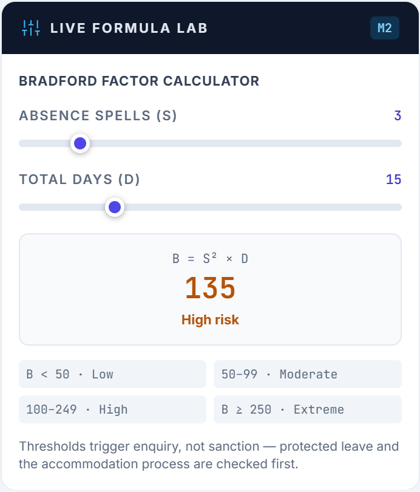
  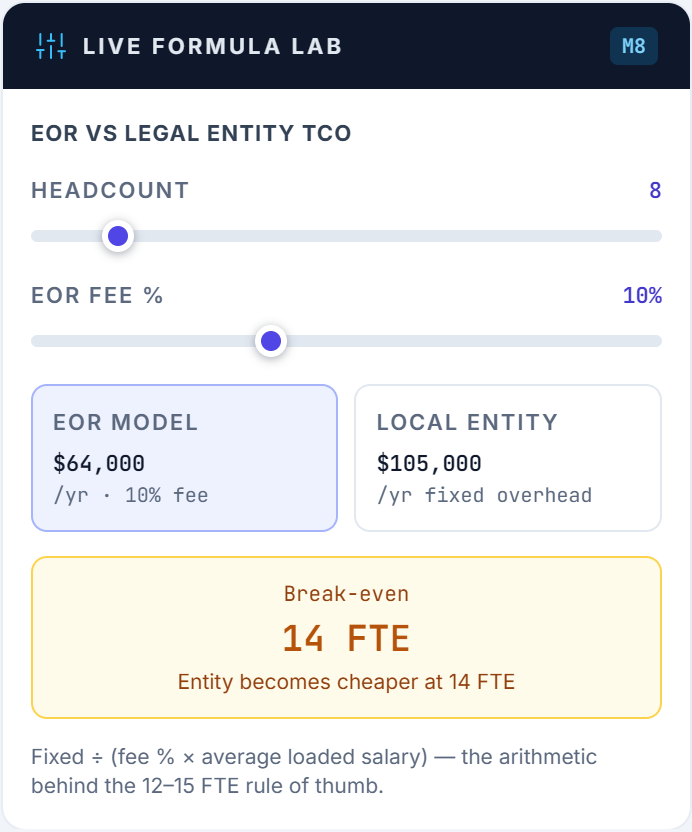
  <br>
  <em>Interactive Academy Formula Workbenches: Real-time mathematical simulation of organizational disruption and international labor liability.</em>
</p>

---

## ⚡ Enterprise HRIS Sandbox Capabilities

PeopleCore provides a comprehensive, production-faithful operational environment running locally in browser memory:

### 1. Unified Employee Directory & Lifecycle Operations
* **Instant Multi-Faceted Querying**: Filter by department, employment status (Active, On-Leave, Terminated), compensation tier, and tenure.
* **Full-Spectrum Employee Records**: Contact data, emergency contacts, compensation history, direct manager hierarchy, and bank details.
* **Manual Lifecycle Onboarding**: Form-validated modal wizard supporting immediate statutory regime assignment, manager mapping, and initial compensation packaging.

<p align="center">
  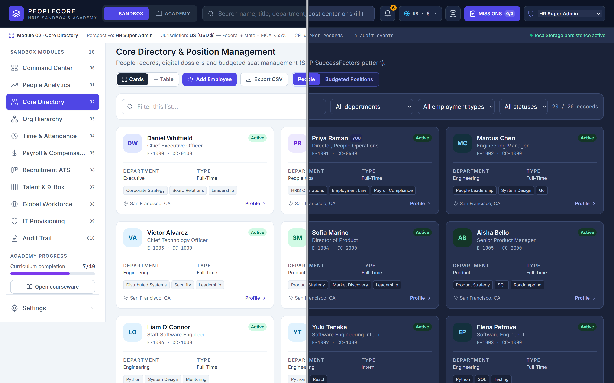
</p>

### 2. Statutory Multi-Jurisdiction Payroll Engine
* **Quad-Regime Support**: Real-time statutory withholding logic for **United States** (USD $), **United Kingdom** (GBP £), **Germany / European Union** (EUR €), and **India** (INR ₹).
* **Live Gross-to-Net Decomposition**: Federal/State taxes, Medicare/Social Security, PAYE, National Insurance, Solidarity surcharges, Provident Fund (PF), and Professional Tax.
* **Statutory Severance & Notice Engine**: Automated separation settlement calculating statutory notice periods, at-will severance schedules, and India Payment of Gratuity Act formulas.

<p align="center">
  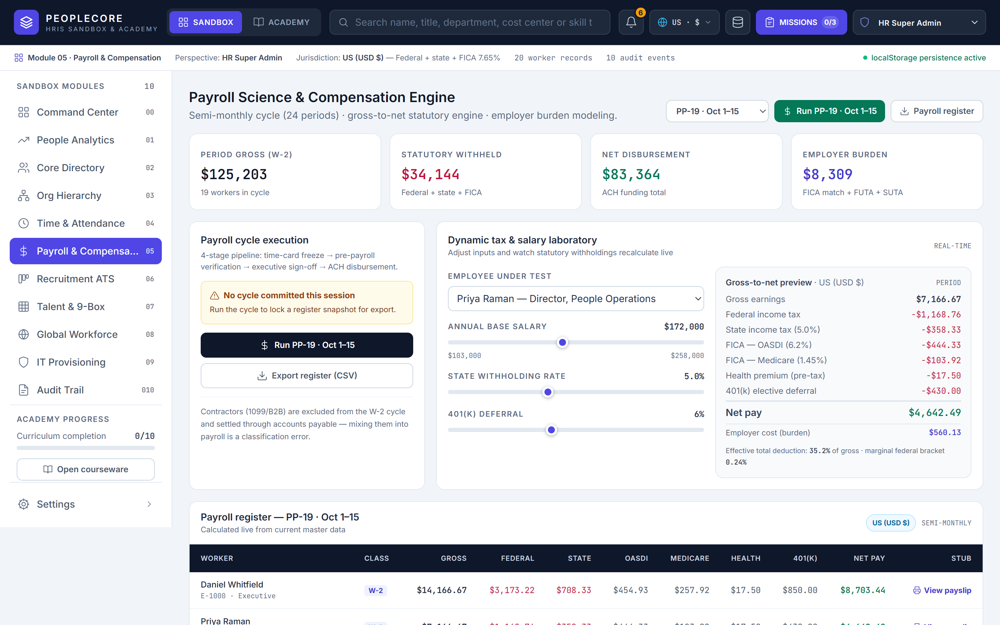
  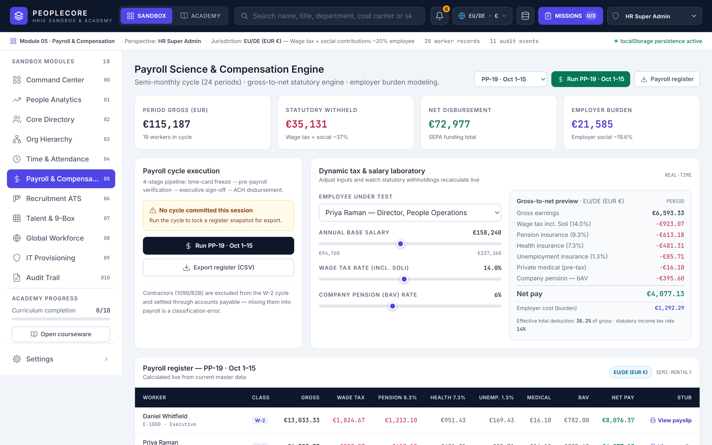
</p>

### 3. Industrial Bulk CSV Ingestion & Org Hierarchy
* **Self-Validating Data Pipeline**: Real-time column header mapping, format verification, duplicate detection, and immediate error reporting before ingestion.
* **Interactive Organizational Hierarchy**: Visual reporting tree showing direct and indirect management chains, department sub-nodes, and structural spans.

<p align="center">
  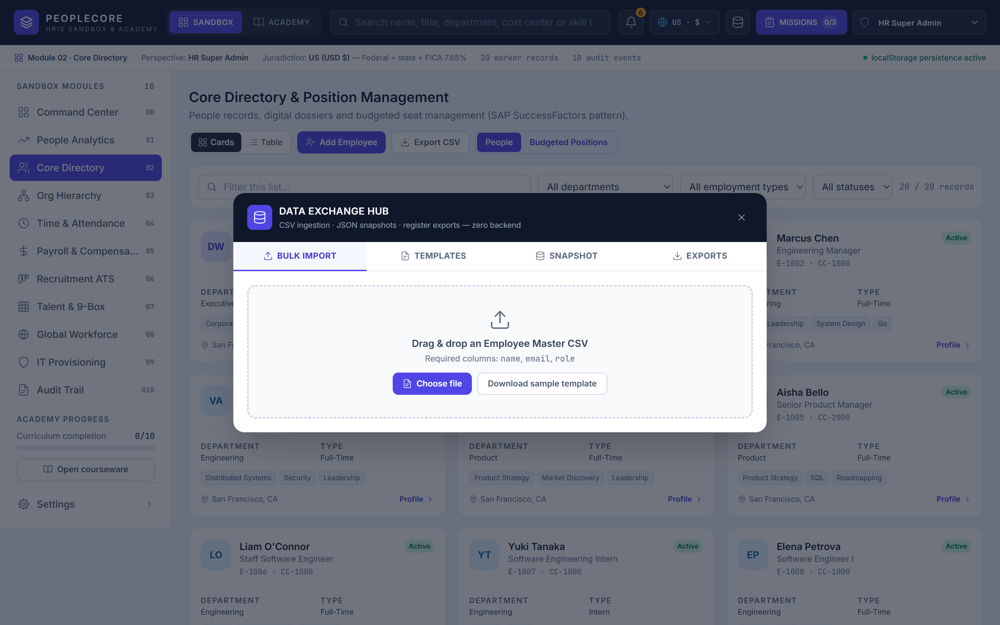
  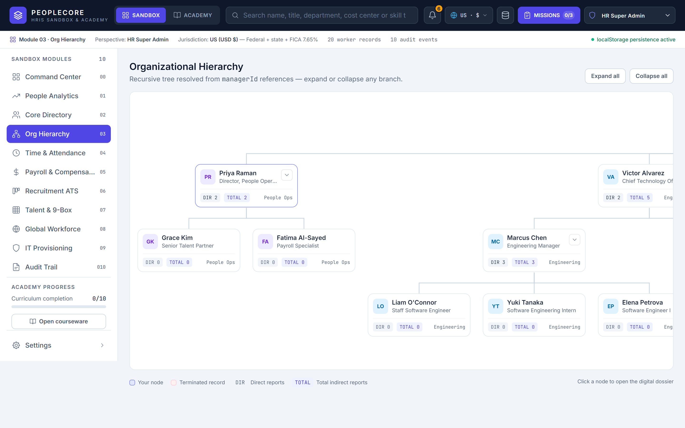
</p>

### 4. Cryptographic Audit Trail & Security Ledger
* **Tamper-Evident Event Logging**: Every state change (payroll run, employee edit, salary adjustment, system reset) generates an immutable, SHA-fingerprinted ledger record.
* **Complete Actor Attribution**: Explicit logging of timestamp, actor role (Super Admin, HR Manager, Department Lead), IP/Client signature, and before-and-after state deltas.

<p align="center">
  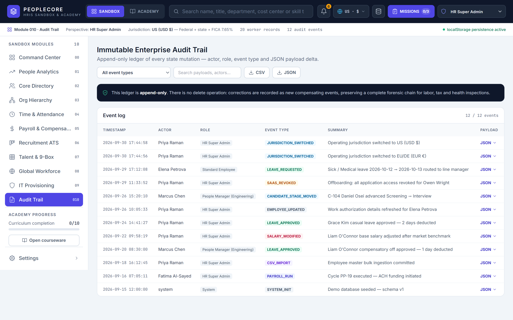
</p>

---

## 📜 Executive Certification & Credential Engine

Upon completing the 10 curriculum modules, learners unlock the comprehensive **100-Question Executive Examination Suite** (10 questions per module, requiring an 80% passing grade per chapter). 

Clearing all competencies issues the **Certificate of Practical Mastery**:
* Rendered dynamically via an HTML5 canvas at **1120 × 792 px (A4 Landscape ratio)**.
* Decorated with high-security gold guilloche patterns, verified laurel seal medallion, and official executive signatory block (**Nitish Kashyap R**, Academy Director).
* Embedded with an immutable, cryptographically generated Credential ID (`PC-PM-XXXX-XXXX...`) verified against local browser state.
* Includes one-click high-resolution download, landscape print styling, and formatted LinkedIn credential copy.

<p align="center">
  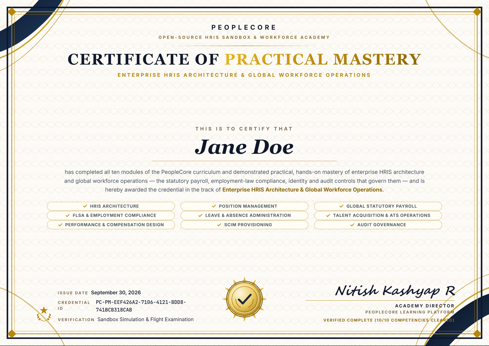
  <br>
  <em>Official Certificate of Practical Mastery: High-resolution credential generated entirely client-side.</em>
</p>

---

## 🏗️ Key Architecture & Engineering Principles

```
┌────────────────────────────────────────────────────────────────────────┐
│                        PeopleCore Architecture                         │
├────────────────────────────────────────────────────────────────────────┤
│                                                                        │
│   ┌───────────────────────────┐      ┌──────────────────────────────┐  │
│   │       landing.html        │      │          index.html          │  │
│   │   Executive Product Tour  │      │  Complete Standalone Engine  │  │
│   │  Responsive Landing Page  │      │  Sandbox + Workforce Academy │  │
│   └─────────────┬─────────────┘      └──────────────┬───────────────┘  │
│                 │                                   │                  │
│                 ▼                                   ▼                  │
│     ┌───────────────────────┐           ┌────────────────────────┐     │
│     │  assets/screenshots/  │           │     assets/audio/      │     │
│     │   20 Retina Captures  │           │   10 Studio Lectures   │     │
│     └───────────────────────┘           └────────────────────────┘     │
│                                                     │                  │
│                                                     ▼                  │
│                                         ┌────────────────────────┐     │
│                                         │  Client Storage Layer  │     │
│                                         │      localStorage      │     │
│                                         │   (hris.sandbox.v1)    │     │
│                                         └────────────────────────┘     │
└────────────────────────────────────────────────────────────────────────┘
```

* **Single-File Enterprise Delivery (`index.html`)**: The entire core application—including 12 operational modules, 10 learning chapters, 70 inline SVG icons, 100 quiz questions, and the canvas certificate generator—is packaged into a single, clean HTML file (~785 KB).
* **Zero Build-Step Stack**: Zero `npm install`, zero bundlers, and zero build toolchains. Built on clean web standards leveraging Vue 3 (prod runtime CDN), Tailwind CSS (runtime engine), Chart.js (CDN), and Google Fonts (Inter & JetBrains Mono).
* **Local-First Data Privacy & State Persistence**: 100% of application state—employee databases, payroll registers, candidate pipelines, theme preferences, and exam achievements—is managed via Vue reactivity and persisted to `localStorage` under `hris.sandbox.v1`. No backend server required; zero employee or student data ever leaves the device.
* **Curated High-Fidelity Audio Narration (`assets/audio/`)**: 10 full-length studio lectures (~420 MB total) synchronized with each curriculum chapter. Features a custom podcast waveform player, dynamic seek bars, ±10-second skip controls, and direct audio file downloads.
* **WCAG 2.2 Level AA Accessibility**: Formally audited across all 12 modules in both Light and Dark themes, guaranteeing strict 4.5:1 text contrast ratios, complete ARIA tablist patterns, keyboard navigation support, and zero emoji in production UI.

---

## 🌐 Live Preview & Hosting Guide

The repository is structured to cleanly separate the **product marketing showcase** from the **core application**:

| File / Directory | Role & Responsibilities | Hosting Recommendation |
|---|---|---|
| **`landing.html`** | **Public Product Website**: Executive overview, interactive feature tour, screenshot lightboxes, curriculum breakdowns, and conversion CTAs. | Default root landing page (or configure web host entry point). |
| **`index.html`** | **Core Standalone Application**: The complete interactive enterprise HRIS sandbox and workforce academy platform. | Secondary path (`/index.html`) or launched directly from `landing.html`. |
| **`assets/screenshots/`** | 20 high-resolution Retina screenshots (2880 × 1800) powering the landing page and documentation. | Serve statically relative to root. |
| **`assets/audio/`** | 10 studio-recorded M4A narration files for the Academy chapters. | Serve statically relative to root. |

### Deploying to Public Static Web Hosts

#### 1. GitHub Pages (Recommended)
1. Navigate to your repository **Settings** → **Pages**.
2. Under **Build and deployment**, select **Deploy from a branch**.
3. Set the branch to `main` and folder to `/ (root)`, then click **Save**.
4. Both `landing.html` and `index.html` will be immediately accessible via:
   - Landing Page: `https://<username>.github.io/peoplecore-hris-sandbox/landing.html`
   - Interactive Sandbox: `https://<username>.github.io/peoplecore-hris-sandbox/index.html`

#### 2. Netlify / Vercel / Cloudflare Pages
* Simply point the deployment to the repository root.
* No build command required (`Build command: None`, `Publish directory: .`).

---

## 🚀 Quickstart / Local Run

Because PeopleCore requires zero build steps, running it locally takes less than five seconds.

### Option 1: Python HTTP Server (Zero Install)
Run from the repository root:
```bash
python -m http.server 8000
```
Open your browser to:
* **Product Landing Page**: [http://localhost:8000/landing.html](http://localhost:8000/landing.html)
* **Direct Interactive Sandbox**: [http://localhost:8000/index.html](http://localhost:8000/index.html)

### Option 2: Node.js `npx serve`
```bash
npx serve .
```

### Option 3: Direct File Execution
Double-click `index.html` or `landing.html` in your file explorer to open it directly in Google Chrome, Microsoft Edge, Safari, or Mozilla Firefox via the `file://` protocol. All core features (including theme toggles, audio playback, and database state) run out-of-the-box.

---

## 📂 Repository Structure

```text
peoplecore-hris-sandbox/
├── .gitignore          # Strict exclusion rules for local developer tooling
├── .npmignore          # Defensive npm publish ignore rules
├── README.md           # Executive product documentation and showcase
├── index.html          # Core standalone HRIS Sandbox & Workforce Academy (~785 KB)
├── landing.html        # Public marketing showcase and hosting landing page (~86 KB)
└── assets/
    ├── audio/          # 10 studio-grade narrative audio lectures (.m4a, ~420 MB)
    └── screenshots/    # 20 Retina product screenshots & split-theme showcases
```

---

## 👨‍💻 Author & Engineering Credits

* **Product Design, Architecture & Curriculum**: **Nitish Kashyap R**
* **GitHub**: [@NitishKashyapR](https://github.com/NitishKashyapR)
* **Repository**: [NitishKashyapR/peoplecore-hris-sandbox](https://github.com/NitishKashyapR/peoplecore-hris-sandbox)
* **LinkedIn**: [linkedin.com/in/nitishkashyapr](https://www.linkedin.com/in/nitishkashyapr)

---

<p align="center">
  <sub>PeopleCore is an open-source, local-first simulation platform created for technical education, system evaluation, and workforce operations training. All employee profiles, payroll amounts, and credential records are simulated data.</sub>
</p>
